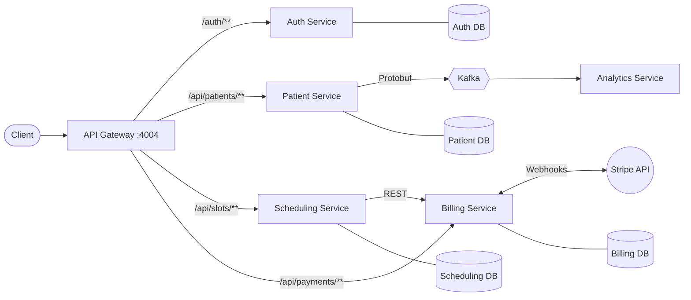

# Patient Management System

A microservices-based platform for managing patients, doctor scheduling, and online appointment payments via Stripe.

Built with **Java 21**, **Spring Boot 3**, **Kafka**, and **Docker**.

## Architecture



## Services

| Service | Description | Key Technologies |
|---|---|---|
| [**api-gateway**](./api-gateway) | Single entry point for all clients. Routes requests and validates JWT signature locally using JWKS | Spring Cloud Gateway |
| [**auth-service**](./auth-service) | User authentication. Issues JWT tokens signed with RSA private key, provides JWKS endpoint for public key distribution | Spring Security, JWT |
| [**patient-service**](./patient-service/patient-service) | Full CRUD for patient records. Publishes events to Kafka on changes | Spring Data JPA, Kafka, Protobuf |
| [**scheduling-service**](./scheduling-service) |  Slot booking with rich domain model and state machine | DDD, Hexagonal Architecture |
| [**billing-service**](./billing-service) | Payment processing via Stripe Checkout. Handles Stripe webhooks | Stripe API, RestClient |
| [**analytics-service**](./analytics-service) | Consumes patient events from Kafka for analytics processing | Kafka Consumer, Protobuf |

## Tech Stack

- Java 21
- Spring Boot 3, Spring Cloud Gateway
- Spring Security, JWT
- Spring Data JPA
- PostgreSQL 17 (isolated DB per service)
- SpringDoc OpenAPI (Swagger UI)
- Kafka (KRaft mode)
- Stripe API (Checkout Sessions + Webhooks)
- JUnit 5, Mockito
- Docker, Docker Compose

## Key Architectural Decisions

### JWT Authentication with RSA and JWKS
The `auth-service` issues JWT tokens signed with an **RSA private key**. The corresponding public key is exposed via a JWKS endpoint (`/.well-known/jwks.json`).
The API Gateway and all business services are configured as OAuth2 Resource Servers. Each service fetches the public key from the JWKS endpoint and validates the JWT signature locally.
This approach reduces latency, removes a single point of failure, and follows the self-contained JWT best practice.

### Asynchronous Communication via Kafka + Protobuf
When a patient record is created or updated, `patient-service` publishes a Protobuf-serialized event to Kafka. `analytics-service` consumes these events asynchronously, ensuring loose coupling between services.

### Domain-Driven Design in Scheduling Service
The `scheduling-service` applies **Pragmatic DDD** with **Hexagonal Architecture (Ports and Adapters)**. The `Slot` entity is a rich domain model with an internal state machine (`FREE → RESERVED → CONFIRMED`) that enforces business invariants. External dependencies (billing, persistence) are abstracted behind port interfaces. See [scheduling-service README](./scheduling-service/README.md) for details.

### Distributed Transaction Handling
Transcational Outbox Pattern is used.

## Getting Started

### Prerequisites
- Docker & Docker Compose
- Stripe account (for test API keys)

### 1. Clone the repository
```bash
git clone https://github.com/AidarSarvartdinov/patient-management.git
cd patient-management
```

### 2. Configure environment variables
Create a `.env` file in the project root:
```env
# Database credentials (per service)
PATIENT_DB_USER=admin_user
PATIENT_DB_PASSWORD=<your-password>
PATIENT_DB_NAME=patientdb

BILLING_DB_USER=admin_user
BILLING_DB_PASSWORD=<your-password>
BILLING_DB_NAME=billingdb

AUTH_DB_USER=admin_user
AUTH_DB_PASSWORD=<your-password>
AUTH_DB_NAME=authdb

SCHEDULING_DB_USER=admin_user
SCHEDULING_DB_PASSWORD=<your-password>
SCHEDULING_DB_NAME=schedulingdb

# Stripe (get from https://dashboard.stripe.com/test/apikeys)
STRIPE_API_KEY=sk_test_...
STRIPE_API_PUBLIC_KEY=pk_test_...
STRIPE_WEBHOOK_SECRET=whsec_...
```

### 3. Run all services
```bash
docker-compose up --build
```

### 4. Access the system
| Resource | URL |
|---|---|
| API Gateway | `http://localhost:4004` |
| Swagger UI (Patient) | `http://localhost:4004/api-docs/patients/swagger-ui` |
| Swagger UI (Auth) | `http://localhost:4004/api-docs/auth/swagger-ui` |
| Swagger UI (Scheduling) | `http://localhost:4004/api-docs/scheduling/swagger-ui` |

## API Routes (via Gateway)

| Method | Path | Service | Auth Required |
|---|---|---|---|
| `POST` | `/auth/login` | auth-service | No |
| `POST` | `/auth/register` | auth-service | No |
| `GET` | `/api/patients` | patient-service | Yes (JWT) |
| `POST` | `/api/patients` | patient-service | Yes (JWT) |
| `PUT` | `/api/patients/{id}` | patient-service | Yes (JWT) |
| `DELETE` | `/api/patients/{id}` | patient-service | Yes (JWT) |
| `POST` | `/api/slots` | scheduling-service | Yes |
| `POST` | `/api/slots/reserve` | scheduling-service | Yes |
| `POST` | `/api/payments` | billing-service | No |
| `POST` | `/stripe/webhook` | billing-service | No (Stripe signature) |
